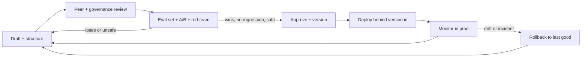

# Prompt Governance

> **Breadcrumb:** [Home](../README.md) › [Docs Index](INDEX.md) › **Prompt Governance**
> **Status:** `Active` · **Owner:** `governance-swarm` · **Last verified:** `2026-06-12`

## 1. Purpose

The lifecycle and control regime for **prompts as governed assets**: how a prompt is authored,
versioned, evaluated, hardened against injection, red-teamed, approved, deployed, monitored, and rolled
back. This is the governance counterpart to the [Prompt Library](03-agents/PROMPT_LIBRARY.md) standard,
and it gates prompt changes the same way [CI/CD](04-quality/CI_CD.md) gates code.

## 2. Context & Scope

- Applies to **every prompt** that shapes an agent's behavior — system prompts, task prompts, judge
  rubrics, and guardian policies — across all three planes in the [Agent Registry](AGENT_REGISTRY.md).
- Sensitive operational prompts live in the private repo; this doc defines the **public standard and
  process**, consistent with the [Public/Private Model](00-overview/PUBLIC_PRIVATE_MODEL.md).
- Aligns to the [NIST AI RMF](https://www.nist.gov/itl/ai-risk-management-framework) functions
  (Govern, Map, Measure, Manage) and the
  [OWASP Top 10 for LLM Applications](https://owasp.org/www-project-top-10-for-large-language-model-applications/)
  risk classes (notably prompt injection and insecure output handling).

## 3. Prompt lifecycle



| Stage | Gate | Owner |
|-------|------|-------|
| Draft | Structured (role, task, constraints, output schema, grounding) | author |
| Review | Peer + governance review for policy + safety intent | governance-swarm |
| Evaluate | Multi-dimensional eval + A/B, **no regression** | quality-swarm |
| Red-team | Adversarial suite passes (see §5) | governance-swarm |
| Approve | Version assigned, record written | governance-swarm |
| Deploy | Referenced by immutable version id | orchestrator |
| Monitor | Traces, eval-score trend, safety flags | observability-swarm |
| Rollback | Revert to last-good version on drift/incident | orchestrator |

## 4. Versioning and promotion

- **Every prompt has a stable `id` and semantic `version`**; changes are diffable and recorded.
- A change is **promotion-eligible only if** it wins or ties its eval set with **no regression** on any
  dimension ([Eval Framework](04-quality/EVAL_FRAMEWORK.md), [Regression Policy](04-quality/REGRESSION_POLICY.md)).
- Promotion writes an immutable **prompt record** (§7) and links the eval run and trace, so any live
  prompt is provenance-traceable.
- The previous approved version remains the **rollback target** until a newer version earns promotion.

## 5. Injection defense and red-teaming

Per the [OWASP LLM Top 10](https://owasp.org/www-project-top-10-for-large-language-model-applications/):

- Treat all external, retrieved, tool, and user content as **untrusted**; enforce an instruction
  hierarchy so retrieved content can never override system policy.
- **Sanitize inputs and validate outputs**; structured output schemas reduce insecure output handling.
- A **guardian model** screens for prompt injection, data exfiltration, and unsafe tool use before any
  tier-2 action ([Responsible AI](06-governance/RESPONSIBLE_AI.md), [Security](06-governance/SECURITY_ARCHITECTURE.md)).
- A maintained **adversarial/red-team set** is part of the eval bar; categories below are evaluated
  before promotion.

| Red-team category | What it probes |
|-------------------|----------------|
| Direct prompt injection | "ignore previous instructions" style overrides |
| Indirect injection | malicious instructions embedded in retrieved/tool content |
| Data exfiltration | attempts to leak secrets, memory, or other clients' data |
| Tool abuse | coercing disallowed or out-of-scope tool calls |
| Jailbreak / policy evasion | bypassing refusal and safety policy |

## 6. Approval and rollback

- **Approval** is a governance gate, not an individual choice: a prompt is promoted only after review +
  passing evals + passing red-team, with the decision recorded.
- **Rollback** is always available and fast: because deployments reference a version id, reverting is a
  pointer change to the last-good version, surfaced as an action in [Alerting](ALERTING.md) when an
  eval-score drop or safety spike is detected.
- High-impact prompts (system + guardian) require explicit human approval per
  [Human-in-the-Loop](06-governance/HUMAN_IN_THE_LOOP.md).

## 7. Prompt record schema

```yaml
# Prompt record — written on every promotion; immutable
prompt:
  id: string                       # stable slug, e.g. "consultation.system"
  version: string                  # semantic version, e.g. "1.4.0"
  status: draft | approved | deprecated
  agent_ref: "AGENT-REGISTRY#<agent-id>"
  role: system | task | judge | guardian
  template_ref: string             # path/uri to the prompt text (may be private)
  inputs_contract: string          # expected variables / grounding sources
  output_schema: string            # required structured output shape
  eval:
    suite_ref: "QUALITY-EVAL-FRAMEWORK"
    run_id: string                 # links the winning eval run
    regression: none               # promotion requires no regression
  red_team:
    suite_ref: string
    result: pass | fail
  approval:
    approver: string               # governance role
    decided_at: "2026-06-12T00:00:00Z"
  rollback_target: string          # previous approved version id
  trace_ref: string                # provenance trace id
```

## 8. Decisions & Rationale

| # | Decision | Rationale |
|---|----------|-----------|
| 1 | Prompts are versioned, immutable-on-promotion assets | Enables deterministic rollback and provenance, like code |
| 2 | No promotion without an eval win and zero regression | Prevents quality drift from "looks better" prompt edits |
| 3 | Red-team set is part of the promotion bar | Treats injection/jailbreak as a release gate, not a post-incident finding |
| 4 | System and guardian prompts require human approval | Highest-blast-radius prompts get the strongest gate |

## 9. Risks & Open Questions

- **Eval coverage gaps.** A prompt can pass a thin eval set and still regress in the field; coverage is
  expanded continuously and tracked in [Continuous Improvement](07-operations/CONTINUOUS_IMPROVEMENT.md).
- **Adversarial drift.** New jailbreak techniques emerge; the red-team set must be refreshed on cadence.
  `[UNVERIFIED]` completeness of the adversarial set at any point in time.
- **Private/public split.** The public standard must never leak sensitive prompt text; enforced by the
  [Public/Private Model](00-overview/PUBLIC_PRIVATE_MODEL.md).

## 10. Grounding & Sources

| # | Claim | Source | Accessed |
|---|-------|--------|----------|
| 1 | Prompt-injection and insecure-output risk classes | <https://owasp.org/www-project-top-10-for-large-language-model-applications/> | 2026-06-12 |
| 2 | Govern/Map/Measure/Manage lifecycle alignment | <https://www.nist.gov/itl/ai-risk-management-framework> | 2026-06-12 |
| 3 | Prompt + governance control set | [`sysprompt_agentx2.md`](../sysprompt_agentx2.md) | 2026-06-12 |

---

### Freshness

- **Created/Updated/Verified:** 2026-06-12 · **Review cadence:** 60d · **Next review:** 2026-08-11
- See [Freshness Policy](07-operations/FRESHNESS_POLICY.md).

### Navigation

- 🏠 [Home](../README.md) · ⬆️ [Docs Index](INDEX.md)
- ↔️ Related: [Prompt Library](03-agents/PROMPT_LIBRARY.md) · [Eval Framework](04-quality/EVAL_FRAMEWORK.md) · [AI Governance](06-governance/AI_GOVERNANCE.md) · [Responsible AI](06-governance/RESPONSIBLE_AI.md)
