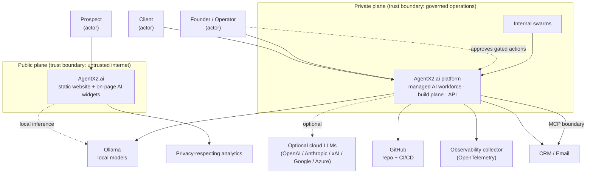

# System Context

> **Breadcrumb:** [Home](../README.md) › [Docs Index](INDEX.md) › **System Context**
> **Status:** `Active` · **Owner:** `architecture-swarm` · **Last verified:** `2026-06-12`

## 1. Purpose

This is the **[C4](https://c4model.com/) Level 1 (System Context)** view of AgentX2.ai: who uses the
system, what external systems it depends on, and where the trust boundaries sit. It is the top of the
architecture stack — drill down via [System Architecture](01-architecture/SYSTEM_ARCHITECTURE.md) and
[API Architecture](API_ARCHITECTURE.md).

## 2. Context & scope

The system has two planes with a hard boundary between them:

- **Public plane** — the static marketing/consultation website. No secrets, no application API,
  client-side AI widgets only.
- **Private plane** — the managed AI workforce, build plane, and (future) API platform, where agents
  use tools, data, and optional cloud models under governance.

Scope is the actors and external systems and the boundaries between them. Internal containers and
components are out of scope here ([System Architecture](01-architecture/SYSTEM_ARCHITECTURE.md)).

## 3. Actors

| Actor | Plane | Interaction |
|-------|-------|-------------|
| Prospect | Public | Browses the static site; uses on-page AI widgets (grounded, no secrets) |
| Client | Private | Receives outcomes from the managed AI workforce |
| Founder / Operator | Private | Sets direction; approves human-gated actions |
| Internal swarms | Private | Build, evaluate, deploy, observe, and operate the platform |

## 4. System context diagram

## 5. External systems

| System | Role | Trust / notes |
|--------|------|---------------|
| Ollama (local) | Default reasoning, code, embeddings, guardian | Local-first; no key required ([Ollama](https://ollama.com/)) |
| Optional cloud LLMs | Opt-in escalation | Private plane only; brokered keys ([Key Management](KEY_MANAGEMENT.md)) |
| GitHub | Source, CI/CD, releases | Build plane; scoped tokens |
| Observability collector | Traces, metrics, events | [OpenTelemetry](https://opentelemetry.io/) GenAI semconv |
| CRM / Email | Customer records + outbound mail | Private plane via [MCP](https://modelcontextprotocol.io/); human-gated writes |
| Analytics | Privacy-respecting usage signal | Public plane; public id only, no PII |

## 6. Trust boundaries

- **Public ↔ internet** — the static site is fully untrusted-input territory; it holds no secrets and
  performs no privileged action ([Security Architecture](06-governance/SECURITY_ARCHITECTURE.md)).
- **Public ↔ private** — the planes do not share credentials or data stores; the public site cannot call
  private services ([Public/Private Model](00-overview/PUBLIC_PRIVATE_MODEL.md)).
- **Private ↔ external** — all outbound tool/SaaS access crosses the governed
  [MCP boundary](MCP_ARCHITECTURE.md) with least-privilege scopes and audit.

## 7. Decisions

- **D-1 Two planes, hard boundary.** Public is static and secret-free; private is governed.
- **D-2 Local-first models.** Cloud LLMs are optional and confined to the private plane.
- **D-3 One governed egress.** External side effects flow only through MCP.

## 8. Risks & open questions

- **Boundary erosion** — any future server-side feature on the public plane must re-justify the
  secret-free guarantee via an ADR.
- **[UNVERIFIED]** The specific managed cloud and secret-manager vendors are environment decisions, not
  asserted here.

## 9. Grounding & Sources

| # | Claim | Source | Accessed |
|---|-------|--------|----------|
| 1 | System Context is C4 Level 1 | <https://c4model.com/> | 2026-06-12 |
| 2 | External tool access standardized via MCP | <https://modelcontextprotocol.io/> | 2026-06-12 |
| 3 | Telemetry to an OpenTelemetry collector | <https://opentelemetry.io/> | 2026-06-12 |
| 4 | Local-first inference via Ollama | <https://ollama.com/> | 2026-06-12 |

---

### Freshness

- **Created/Updated/Verified:** 2026-06-12 · **Review cadence:** 60d · **Next review:** 2026-08-11
- See [Freshness Policy](07-operations/FRESHNESS_POLICY.md).

### Navigation

- 🏠 [Home](../README.md) · ⬆️ [Docs Index](INDEX.md)
- ↔️ Related: [System Architecture](01-architecture/SYSTEM_ARCHITECTURE.md) · [API Architecture](API_ARCHITECTURE.md) · [Public/Private Model](00-overview/PUBLIC_PRIVATE_MODEL.md)
