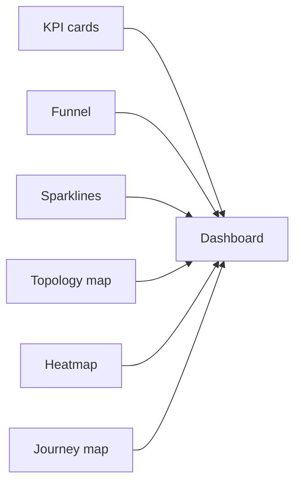
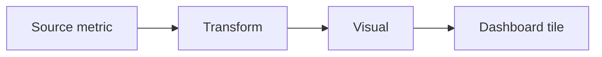

# Visual System

> **Breadcrumb:** [Home](../README.md) › [Docs Index](INDEX.md) › **Visual System**
> **Status:** `Active` · **Owner:** `website-swarm` · **Last verified:** `2026-06-12`

## 1. Purpose

The **visual and dashboard language** that complements the [Design System](02-website/DESIGN_SYSTEM.md):
the catalog of charts and visuals, the standards for diagrams, dashboard layout rules, dark-mode-first
palette usage, and the accessibility rules that make data legible to everyone. It is how the platform
turns the [Metrics Catalog](05-observability/METRICS_CATALOG.md) into the
[Mission Control](05-observability/MISSION_CONTROL.md) single pane of glass.

## 2. Context & Scope

- Inherits **tokens, theme, and components** from the [Design System](02-website/DESIGN_SYSTEM.md);
  this doc adds the **data-visualization** layer (charts, diagrams, dashboards).
- The aesthetic target is **executive, AI-native, finance-grade, dark-mode-first**; visuals are
  restrained, high-contrast, and signal-dense.
- Accessibility is non-negotiable: every visual meets the [Accessibility](02-website/ACCESSIBILITY.md)
  bar and interactive visuals follow the
  [W3C ARIA Authoring Practices Guide](https://www.w3.org/WAI/ARIA/apg/).

## 3. Visual catalog

| Visual | Primary use | Encoding | Accessibility note |
|--------|-------------|----------|--------------------|
| KPI card | headline metric + trend | number + delta + sparkline | label + value in text; trend stated, not color-only |
| Funnel | stage conversion | ordered stages, relative width | stage labels + values; order conveyed by position + text |
| Sparkline | compact trend | tiny line over time | paired with a numeric value and accessible name |
| Topology map | system/agent relationships | nodes + edges | nodes labeled; relationships in text/`aria` description |
| Heatmap | density across two dimensions | color intensity grid | include legend + values; never color as the only signal |
| Journey map | persona path across stages | stages + touchpoints | each step labeled and reachable by keyboard |
| Line / bar | time series / comparison | axis-anchored series | axis titles, units, and data table fallback |

## 4. Diagram standards (Mermaid)

- **Mermaid is the standard** for architecture, sequence, flow, and state diagrams across the docs and
  dashboards (consistent with the rest of the repository).
- Declare a clear **direction** (`LR`/`TD`), give every node a **descriptive label**, and keep diagrams
  to one idea each.
- Apply color via **token-mapped `classDef`** (semantic, not decorative) and never rely on color alone
  to convey meaning — pair with labels and shape.
- Provide a **text alternative** (caption or surrounding prose) so the diagram's meaning survives
  without rendering.

## 5. Dashboard layout rules

- **Most-important-top-left:** the highest-priority KPI occupies the primary focal position; detail
  flows down and right (progressive disclosure).
- **Grid + density:** a consistent responsive grid; signal-dense but not cluttered; generous whitespace
  per the [Design System](02-website/DESIGN_SYSTEM.md).
- **One audience per view:** each dashboard serves a single audience/decision; tiles map to defined
  [metrics](05-observability/METRICS_CATALOG.md) with an owner.
- **3-clicks-to-any-data rule:** any metric on [Mission Control](05-observability/MISSION_CONTROL.md) is
  reachable in **three clicks or fewer** from the top-level view (overview → domain → detail).

## 6. Dark-mode-first palette usage

- **Dark theme is primary**, light theme supported; both meet WCAG 2.2 AA contrast via the design
  tokens ([Accessibility](02-website/ACCESSIBILITY.md)).
- Use the **single accent + secondary accent** for emphasis; reserve **semantic state colors**
  (success/warn/error) for status only, never decoration.
- Maintain sufficient contrast for **data ink** (lines, bars, text on tiles) in both themes; verify
  against tokens, not eyeballing.

## 7. Accessibility of visuals

Per the [W3C ARIA APG](https://www.w3.org/WAI/ARIA/apg/) and the [Accessibility](02-website/ACCESSIBILITY.md)
standard:

- **Color is never the only signal** — pair it with labels, shape, pattern, or text.
- **Keyboard + screen reader:** interactive charts are operable by keyboard and expose an accessible
  name/description; complex visuals offer a **data-table fallback**.
- **Respect `prefers-reduced-motion`:** animated transitions degrade gracefully.
- **Legends and units** are always present; nothing relies on hover-only disclosure.

## 8. Decisions & Rationale

| # | Decision | Rationale |
|---|----------|-----------|
| 1 | One visual catalog mapped to metric types | Consistent encodings; readers learn the language once |
| 2 | Mermaid as the single diagram standard | Diffable, agent-authorable, consistent across docs + dashboards |
| 3 | 3-clicks-to-any-data rule | Forces shallow, navigable information architecture |
| 4 | Color never the only signal | Meets accessibility and finance-grade legibility requirements |

## 9. Risks & Open Questions

- **Over-density.** Executive dashboards tempt overcrowding; density is reviewed against the layout
  rules. `[UNVERIFIED]` optimal tile count per view pending usability testing.
- **Chart-library accessibility.** Any third-party charting must meet the ARIA bar or be wrapped with
  accessible alternatives.
- **Theme contrast drift.** New accent usage must be re-checked against tokens to avoid contrast
  regressions in either theme.

## 10. Grounding & Sources

| # | Claim | Source | Accessed |
|---|-------|--------|----------|
| 1 | Accessible patterns for interactive widgets/charts | <https://www.w3.org/WAI/ARIA/apg/> | 2026-06-12 |
| 2 | Structured-data vocabulary for content/visual metadata | <https://schema.org/> | 2026-06-12 |
| 3 | Mission control + visual direction | [`sysprompt_agentx2.md`](../sysprompt_agentx2.md) | 2026-06-12 |

---

### Freshness

- **Created/Updated/Verified:** 2026-06-12 · **Review cadence:** 60d · **Next review:** 2026-08-11
- See [Freshness Policy](07-operations/FRESHNESS_POLICY.md).

### Navigation

- 🏠 [Home](../README.md) · ⬆️ [Docs Index](INDEX.md)
- ↔️ Related: [Design System](02-website/DESIGN_SYSTEM.md) · [Accessibility](02-website/ACCESSIBILITY.md) · [Mission Control](05-observability/MISSION_CONTROL.md) · [Metrics Catalog](05-observability/METRICS_CATALOG.md)
