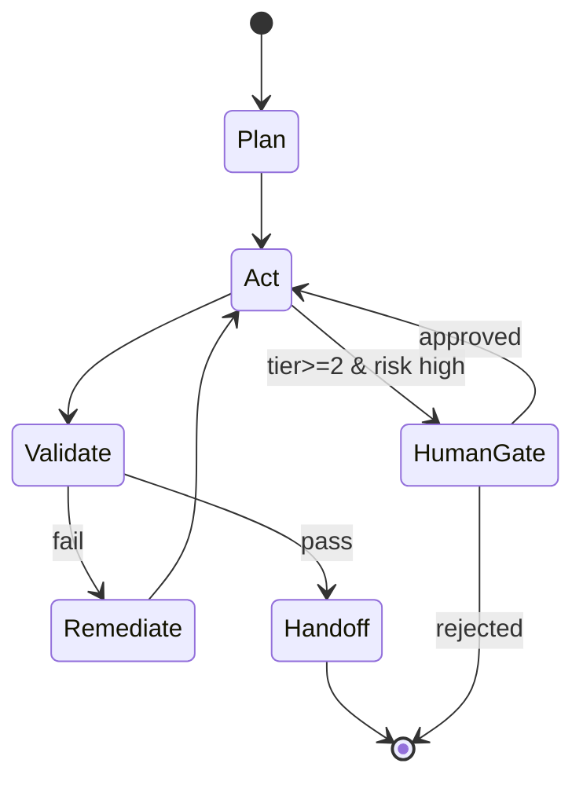

# Agent Spec — {{AGENT_NAME}}

> **Breadcrumb:** [Home](../../README.md) › [Docs Index](../INDEX.md) › [Agent Catalog](../03-agents/AGENT_CATALOG.md) › **{{AGENT_NAME}}**

## 1. Mission (one sentence)

What outcome this agent owns. Outcome, not activity.

## 2. Contract

| Field | Value |
|-------|-------|
| **Inputs** | structured trigger + context payload (schema below) |
| **Outputs** | structured result (schema below) — never free-text-only |
| **Tools** | explicit allow-list (see [Tool Routing](../01-architecture/ORCHESTRATION.md)) |
| **Model** | primary `<model_primary>`, fallback `<model_fallback>` (local Ollama) |
| **Memory** | what it reads/writes (see [Memory Architecture](../01-architecture/MEMORY_ARCHITECTURE.md)) |
| **Autonomy tier** | `<0–3>` (see [Tiered Autonomy](../06-governance/HUMAN_IN_THE_LOOP.md)) |

### Input schema (JSON)

```json
{ "task_id": "string", "intent": "string", "context": {}, "constraints": {}, "trace_id": "string" }
```

### Output schema (JSON)

```json
{ "task_id": "string", "status": "ok|needs_human|failed", "result": {}, "evidence": [], "cost": {}, "trace_id": "string", "timestamp": "2026-06-12T00:00:00Z" }
```

## 3. Behavior (state machine)



## 4. Tools & Permissions

| Tool | Scope | Least-privilege rationale |
|------|-------|---------------------------|
| … | … | … |

## 5. Metrics (what "good" means)

| Metric | Target | Source |
|--------|--------|--------|
| Success rate | … | [Metrics Catalog](../05-observability/METRICS_CATALOG.md) |
| p95 latency | … | OTel GenAI spans |
| Cost / task | … | token + tool ledger |
| Escalation rate | … | … |
| Eval score | ≥ threshold | [Eval Framework](../04-quality/EVAL_FRAMEWORK.md) |

## 6. Escalations & Human Approval

- **When it pauses:** … (risk triggers)
- **Who approves:** …
- **Timeout default:** … (what happens if no human responds)

## 7. Grounding & Sources

| # | Claim | Source | Accessed |
|---|-------|--------|----------|
| 1 | … | … | 2026-06-12 |

---

### Freshness

- **Created/Updated/Verified:** 2026-06-12 · **Review cadence:** 60d · **Next review:** 2026-08-11
- See [Freshness Policy](../07-operations/FRESHNESS_POLICY.md).

### Navigation

- ⬆️ [Agent Catalog](../03-agents/AGENT_CATALOG.md) · [Docs Index](../INDEX.md) · 🏠 [Home](../../README.md)
